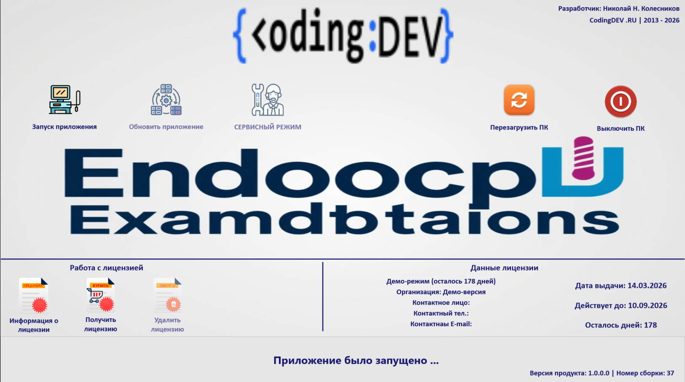

# Endoscopic Examination

## Интерфейс загрузчика приложения:

Техническая документация программного комплекса "Эндоскопические исследования"

| Атрибут    |  Значение   |
| :-- | :-- |
|  Версия документа   |   1.2  |
|  Дата   |  12.03.2026   |
|  Платформа   | Embarcadero Delphi (FireMonkey)    |
|  Целевая ОС   |  Windows (с потенциаломкроссплатформенности)   |
|Тип приложения|Десктопное медицинское приложение для работы с видео и данными пациентов|

# Оглавление

1. Введение и назначение 
2. Архитектура приложения 
> 2.1 Диаграмма модулей (Контекст)  
> 2.2 Диаграмма классов (Ядро)  
> 2.3 Схема базыданных  
3. Модули системы (детальное описание) 
> 3.1 Ядро приложения (Главная форма) 
> 3.2 Модуль загрузки (LoadUnit) 
> 3.3 Модуль работы с БД (uStudiesDatabase) 
> 3.4 Модуль видеозахвата (uVideoRecorderModule) 
> 3.5 Модуль работы с USB (uUSBFlashes) 
> 3.6 Модуль лицензирования (uLicense) 
> 3.7 Модуль логирования (uLogger) 
> 3.8 Модуль статистики (uStatistics) 
> 3.9 Модуль кастомных диалогов (uCustomDialogPanel) 
> 3.10 Модули типов и данных (uGlobalVarType, uStudyData) 
> 3.11 Модули Media (Cam) 
> 3.12 Модуль Bluetooth (uBluetoothRemote) 
4. Руководство разработчика 
> 4.1 Сборка проекта 
> 4.2 Структура директорий 
> 4.3 Конфигурация 
> 4.4 Логирование и отладка 
5. Заключение и рекомендации 

## 1. Введение и назначение

Программный комплекс"Эндоскопические исследования" предназначен для автоматизациирабочего места врача-эндоскописта.
Основные функции: 
* Создание и ведение базы данных пациентов и исследований.
* Подключение к USB-видеокамерам (эндоскопам) и просмотр видео в реальномвремени.
* Запись видео-исследований в формате MP4 (с использованием кодеков FFmpeg).
* Захват и сохранение отдельных кадров (снимков) в формате JPG.
* Экспорт данных исследования (видео, снимки, JSON-манифест) на USB-накопители.
* Защита приложения с помощью системы лицензирования (демо/полная версия).
* Детальное логирование всех действий пользователя и системных событий.

## 2. Архитектура приложения 
Приложение построено по гибридной архитектуре, сочетающей объектно-ориентированныйподход и классический событийно-ориентированный дизайн Delphi. Ключевым паттерномявляется  **Фасад**, реализованный в главной форме, и внедрение зависимостей дляспециализированных модулей.

### 2.1 Диаграмма модулей (Контекст) 
Эта диаграмма показывает, как основные модуливзаимодействуют с главной формой ивнешними системами.

### 2.2 Диаграмма классов (Ядро) 
Диаграмма основных классов и их взаимосвязей.

# Детальное описание взаимодействий на диаграмме 

## 1. Внешние системы и устройства 
|Элемент|Роль|Взаимодействие|
| :-- | :-- | :-- |
|Врач|Основной пользователь|Работает через UI-компоненты, вставляет USB,управляет камерой|
|USBКамера|Источник видеопотока|Передает видео в модуль захвата|
|USB-накопитель|Целевое устройство дляэкспорта|Получает копии исследований|
|Windows OS|Базовая платформа|Предоставляет API для работы с железом,файловой системой|

## 2. Ядро приложения

|Компонент|Назначение|Ключевые функции|
| :-- | :-- | :-- |
|TLoadAppForm|Форма загрузки|Инициализация лицензии, проверка версии, отображениепрогресса|
|TMainAppForm|ГЛАВНЫЙ ФАСАД|Координация всех модулей, обработка событий UI,управление состоянием приложения|
|FMX Компоненты|Визуальнаячасть|Кнопки, списки, поля ввода, отображение видео|

## 3. Специализированные модули

|Модуль|Назначение|Взаимодействуетс|Ключевые методы|
| :-- | :-- | :-- | :-- |
|uStudiesDatabase|Работа с БДSQLite|Файл БД, OS|AddStudy, GetStudy,FindStudies|
|uVideoRecorderModule|Управлениекамерой|USB Camera,FFmpeg DLL|StartRecording,CaptureFrame,ConnectToCamera|
|uUSBFlashes|Работа с USB|Windows API, USB-диск|FindUSBFlashes,LoadToComboBox,FormatSize|
|uLicense|Лицензирование|Windows (HWID),license.dat|CheckLicense,IsDemoMode,GetLicenseStatus|
|uLogger|Логирование|Файловаясистема, LOG/|LogInfo, LogError,LogDebug|
|uStatistics|Статистика|БД (косвенно)|LoadStatistics,GenerateTextReport|
|uCustomDialogPanel|Кастомныедиалоги|Главная форма|ShowConfirm,ShowError|
|uBluetoothRemote|Bluetooth|-|-|

## 4. Вспомогательные модули

|Модуль|Назначение|
| :-- | :-- |
|uGlobalVarType/uStudyData|uGlobalVarType/uStudyDataОпределение структур данных (TPatientData, TStudyRecord)|
|Cam|Библиотечные модули Media для работы со списками камер|

## 5. Файловая система приложения
|Элемент|Назначение|Формат|Создается|
| :-- | :-- | :-- | :-- |
|DATA/db.ssl3|База данных исследований (зашифрован)|SQLite|Автоматически|
|DATA/RESEARCH/|Папки с видео иснимками|Папки, .mp4, .jpg|При созданииисследования|
|LOG/|Файлы логов|.txt|Автоматически|
|CODECS/|FFmpeg DLL длякодирования|.dll|Разработчиком|
|license.dat|Файл лицензии|.dat (зашифрован)|Модулемлицензирования|

## 6. Потоки данных
### Поток создания исследования:
#### Врач → UI (карточка пациента) → TMainAppForm → uStudiesDatabase (сохранение в БД) →→ Создание папки в DATA/RESEARCH/ → Готово к записи
### Поток записи видео:
#### USB Камера → uVideoRecorderModule → TMainAppForm →→ Сохранение в папку исследования → Обновление ListView снимков
### Поток экспорта на USB:
#### Врач (выбор исследования и USB) → TMainAppForm →
→ uUSBFlashes (проверка USB) → Копирование файлов из DATA/RESEARCH/ →→ USB-накопитель → Создание study_info.json
### Поток логирования:
#### Любой модуль → uLogger → Запись в LOG/log_YYYY-MM-DD.txt

## 7. Ключевые особенности архитектуры

> 1. **Фасад** (TMainAppForm)—центральный элемент, через который проходят всеоперации.
> 2. **Инверсия зависимостей** —модули не зависят друг от друга, только от интерфейсов.
> 3. **Слабая связанность** —каждый модуль решает только свою задачу.
> 4. **Потокобезопасность** —логирование и экспорт работают в отдельных потоках.
> 5. **Обработка ошибок** —везде используются try-except блоки с записью в лог.

#### Эта архитектура обеспечиваетмасштабируемость(легко добавить новые модули)иподдерживаемость(можно править один модуль, не ломая другие).
