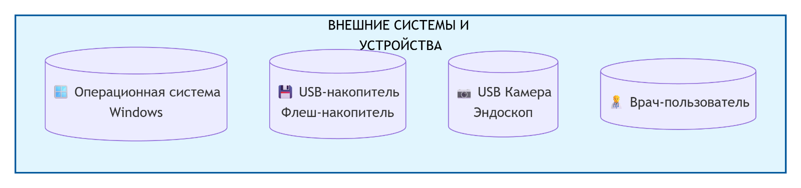

# Endoscopic Examination

Техническая документация программного комплекса "Эндоскопические исследования"

| Атрибут    |  Значение   |
| :-- | :-- |
|  Версия документа   |   1.2  |
|  Дата   |  12.03.2026   |
|  Платформа   | Embarcadero Delphi (FireMonkey)    |
|  Целевая ОС   |  Windows (с потенциаломкроссплатформенности)   |
|Тип приложения|Десктопное медицинское приложение для работы с видео и данными пациентов|

# Оглавление

1. Введение и назначение 
2. Архитектура приложения 
> 2.1 Диаграмма модулей (Контекст)  
> 2.2 Диаграмма классов (Ядро)  
> 2.3 Схема базыданных  
3. Модули системы (детальное описание) 
> 3.1Ядро приложения (Главная форма) 
> 3.2Модуль загрузки (LoadUnit) 
> 3.3Модуль работы с БД (uStudiesDatabase) 
> 3.4Модуль видеозахвата (uVideoRecorderModule) 
> 3.5Модуль работы с USB (uUSBFlashes) 
> 3.6Модуль лицензирования (uLicense) 
> 3.7Модуль логирования (uLogger) 
> 3.8Модуль статистики (uStatistics) 
> 3.9Модуль кастомных диалогов (uCustomDialogPanel) 
> 3.10Модули типов и данных (uGlobalVarType, uStudyData) 
> 3.11Модули RVMedia (CamList, SampleCamList) 
> 3.12Модуль Bluetooth (uBluetoothRemote) 
4. Руководство разработчика 
> 4.1 Сборка проекта 
> 4.2 Структура директорий 
> 4.3 Конфигурация 
> 4.4 Логирование и отладка 
5. Заключение и рекомендации 

## 1. Введение и назначение

Программный комплекс"Эндоскопические исследования" предназначен для автоматизациирабочего места врача-эндоскописта.
Основные функции: 
* Создание и ведение базы данных пациентов и исследований.
* Подключение к USB-видеокамерам (эндоскопам) и просмотр видео в реальномвремени.
* Запись видео-исследований в формате MP4 (с использованием кодеков FFmpeg).
* Захват и сохранение отдельных кадров (снимков) в формате JPG.
* Экспорт данных исследования (видео, снимки, JSON-манифест) на USB-накопители.
* Защита приложения с помощью системы лицензирования (демо/полная версия).
* Детальное логирование всех действий пользователя и системных событий.

## 2. Архитектура приложения 
Приложение построено по гибридной архитектуре, сочетающей объектно-ориентированныйподход и классический событийно-ориентированный дизайн Delphi. Ключевым паттерномявляется  **Фасад**, реализованный в главной форме, и внедрение зависимостей дляспециализированных модулей.

### 2.1 Диаграмма модулей (Контекст) 
Эта диаграмма показывает, как основные модуливзаимодействуют с главной формой ивнешними системами.

### 2.2 Диаграмма классов (Ядро) 
Диаграмма основных классов и их взаимосвязей.

